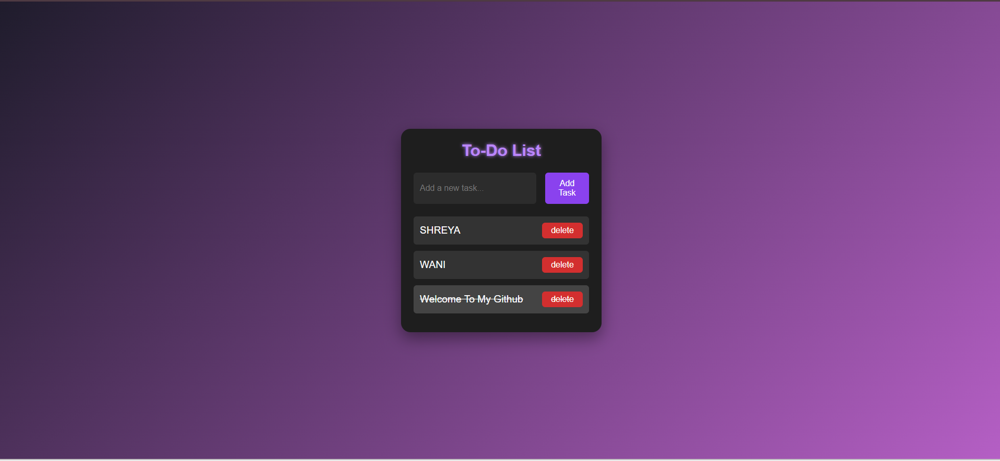

# To-Do List Web App

This is a simple and clean To-Do List web application built using HTML, CSS, and JavaScript. It lets you add, complete, and delete tasks easily. All tasks are saved in your browser using localStorage, so they remain even after refreshing the page.

🔗 **Live Demo:** [Click here to view](https://shreya-wani.github.io/ToDoList-LocalHost/)

## Features

- Add new tasks by clicking the button or pressing the Enter key
- Mark tasks as completed by clicking on them
- Delete tasks individually
- Tasks are stored in the browser using localStorage

## Technologies Used

- HTML
- CSS (with basic animations)
- JavaScript
- localStorage for saving tasks

## Screenshot

*Note: Replace the path above if your image has a different name or folder.*

## Note

This project is currently not responsive. It is best viewed on desktop screens.

## Folder Structure

Your project folder should look like this:

todo-list/
│
├── index.html  
├── styles.css  
├── script.js  
├── img/
│   └── todo-screenshot.png  
└── README.md

## Future Improvements

- Add the ability to edit tasks
- Add filter options like All, Completed, and Pending
- Host the project live using GitHub Pages

---

Created by Shreya Wani
